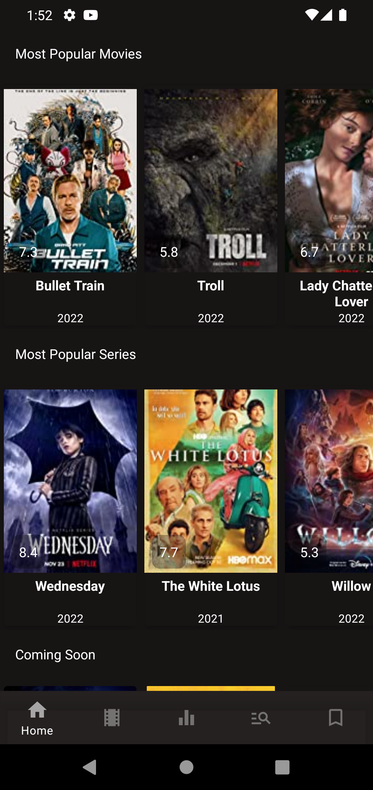
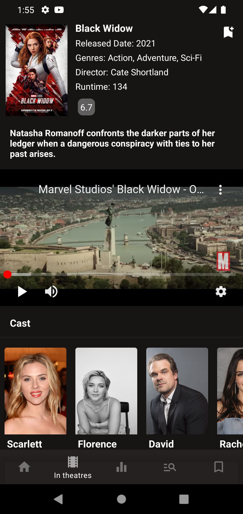
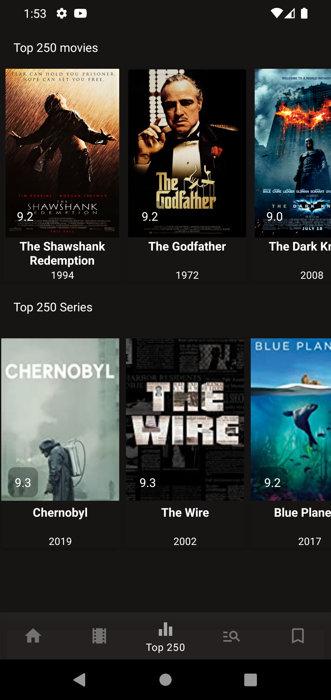
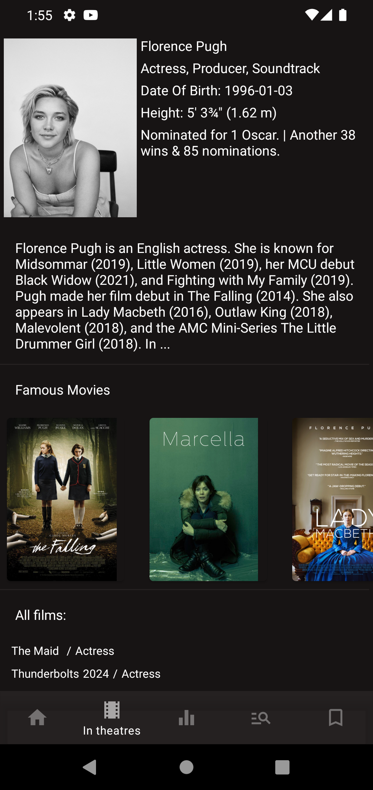

# Watch Out!
This appliction demonstartes information about movies and TV shows in different categories:
- Most popular movies and series
- Coming soon
- Now in theatre
- Top 250 movies & Top 250 TV shows
- Searching 
- Adding content to your list

| Main Screen | Movie Info|
| ------------- | ------------- |
||

|TOP 250|Actor Info|
| ------------- | ------------- |
|   |  |

## Tech stack & Open-source libraries
* Minimum SDK level 23
#### 1. Architecture
* MVVM Architecture
* Clean Code
#### 2. Data
* Room
* Retrofit
*  OkHttp
#### 3. Base Structure
* Single Activity
* Fragments
* UseCases
* Coroutines
#### 4. UI
* Glide
* YoutubePlayer
#### 5. DI
* Koin
#### 5. Navigation
* Navigation component

________

### Open API
Watch Out! using the open source api -  [IMDb API](https://imdb-api.com)
